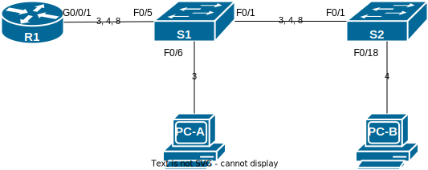

# Маршрутизация между VLAN
### Задание

1. Выполнить начальную настройку устройств.
2. Настроить VLANы и на коммутаторах.
3. Организовать маршрутизацию в сети.

### Схема сети L1/L2



### Команды для начальной настройки устройства

Смена имени устройства
```
(config)# hostname <string>
```
Отключение поиска по DNS
```
(config)# no ip domain-lookup
```
Установка пароля на доступ в EXEC
```
(config)# enable password <password>
```
Установка пароля на вход через консольный провод
```
(config)# line console 0
(config-line)# password <password>
(config-line)# login
(config-line)# exit
```
Установка пароля на вход через Telnet или SSH
```
(config)# line vty 0 4
(config-line)# password <password>
(config-line)# login
(config-line)# exit
```
Включение службы шифрования паролей
```
(config)# service password-encryption
```
Создание баннера при подключении к устройству
```
(config)# banner motd # text #
```
Установка часов на устройстве
```
(config)# clock set 20:22:00 1 sep 2022
```
Просмотр текущей конфигурации
```
# show running-config
```
Копирование текущей конфигурации в стартовую
```
# copy running-config startup-config
```

