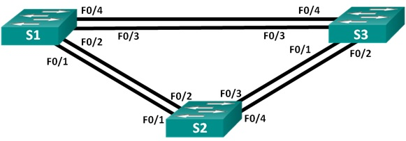
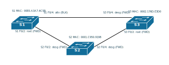
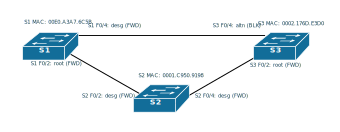
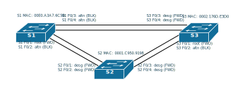

# Настройка STP

### Задание
1. [Построить сеть и определить корневой мост](README.md#%D0%BE%D0%BF%D1%80%D0%B5%D0%B4%D0%B5%D0%BB%D0%B5%D0%BD%D0%B8%D0%B5-%D0%BA%D0%BE%D1%80%D0%BD%D0%B5%D0%B2%D0%BE%D0%B3%D0%BE-%D0%BC%D0%BE%D1%81%D1%82%D0%B0-%D0%B8-%D1%81%D0%BE%D1%81%D1%82%D0%BE%D1%8F%D0%BD%D0%B8%D1%8F-%D0%B2%D1%81%D0%B5%D1%85-%D0%BF%D0%BE%D1%80%D1%82%D0%BE%D0%B2)
2. [Наблюдение за процессом выбора протоколом STP порта, исходя из стоимости портов](README.md#%D0%B8%D0%B7%D0%BC%D0%B5%D0%BD%D0%B5%D0%BD%D0%B8%D0%B5-%D1%81%D1%82%D0%BE%D0%B8%D0%BC%D0%BE%D1%81%D1%82%D0%B8-%D0%BF%D0%BE%D1%80%D1%82%D0%B0)
3. [Наблюдение за процессом выбора протоколом STP порта, исходя из приоритета портов](README.md#%D0%B2%D1%8B%D0%B1%D0%BE%D1%80-%D0%BF%D1%80%D0%BE%D1%82%D0%BE%D0%BA%D0%BE%D0%BB%D0%BE%D0%BC-stp-%D0%BF%D0%BE%D1%80%D1%82%D0%BE%D0%B2-%D0%BF%D1%80%D0%B8-%D0%B2%D1%81%D0%B5%D1%85-%D0%B0%D0%BA%D1%82%D0%B8%D0%B2%D0%B8%D1%80%D0%BE%D0%B2%D0%B0%D0%BD%D0%BD%D1%8B%D1%85-%D0%BF%D0%BE%D1%80%D1%82%D0%B0%D1%85-%D0%B2-%D1%81%D1%85%D0%B5%D0%BC%D0%B5)

### Исходные данные
#### Схема сети

#### Таблица IP адресации
Устройство | Интерфейс  | IP Адрес  | Маска подсети
---------- | ---------- | --------- | -------------
S1 | VLAN 1 | 192.168.1.1 | 255.255.255.0
S2 | VLAN 1 | 192.168.1.2 | 255.255.255.0
S3 | VLAN 1 | 192.168.1.3 | 255.255.255.0

Конфигурационные файлы коммутаторов [S1](../lab02/configs/S1), [S2](../lab02/configs/S2) и [S3](../lab02/configs/S3), используемые в лабораторной работе

### Предварительная настройка устройств
После отправки syslog сообщения, возвращает текст в консоль, который вы уже набрали до сообщения syslog 
```
(config)# line console 0	
(config-line)# logging synchronous
(config-line)# exit
```
Отключить все порты
```
(config)# interface range FastEthernet 0/1-24
(config-if-range)# shutdown
(config-if-range)# exit
```
Перевести порты в транк
```
(config)# interface FastEthernet 0/4
(config-if)# switchport mode trunk
(config-if)# no shutdown
(config-if)# exit
```

### Определение корневого моста и состояния всех портов
Отображение данных протокола spanning-tree на коммутаторе
```
# show spanning-tree
```
Вывод информации о протоколе STP коммутатор S1
```
S1#show spanning-tree 
VLAN0001
  Spanning tree enabled protocol ieee
  Root ID    Priority    32769
             Address     0001.C950.9198
             Cost        19
             Port        2(FastEthernet0/2)
             Hello Time  2 sec  Max Age 20 sec  Forward Delay 15 sec

  Bridge ID  Priority    32769  (priority 32768 sys-id-ext 1)
             Address     00E0.A3A7.6C5B
             Hello Time  2 sec  Max Age 20 sec  Forward Delay 15 sec
             Aging Time  20

Interface        Role Sts Cost      Prio.Nbr Type
---------------- ---- --- --------- -------- --------------------------------
Fa0/4            Altn BLK 19        128.4    P2p
Fa0/2            Root FWD 19        128.2    P2p
```
Вывод информации о протоколе STP коммутатор S2 **(корневой мост)**
```
S2#show spanning-tree 
VLAN0001
  Spanning tree enabled protocol ieee
  Root ID    Priority    32769
             Address     0001.C950.9198
             This bridge is the root
             Hello Time  2 sec  Max Age 20 sec  Forward Delay 15 sec

  Bridge ID  Priority    32769  (priority 32768 sys-id-ext 1)
             Address     0001.C950.9198
             Hello Time  2 sec  Max Age 20 sec  Forward Delay 15 sec
             Aging Time  20
```
Вывод информации о протоколе STP коммутатор S3
```
S3#show spanning-tree 
VLAN0001
  Spanning tree enabled protocol ieee
  Root ID    Priority    32769
             Address     0001.C950.9198
             Cost        19
             Port        2(FastEthernet0/2)
             Hello Time  2 sec  Max Age 20 sec  Forward Delay 15 sec

  Bridge ID  Priority    32769  (priority 32768 sys-id-ext 1)
             Address     0002.176D.E3D0
             Hello Time  2 sec  Max Age 20 sec  Forward Delay 15 sec
             Aging Time  20

Interface        Role Sts Cost      Prio.Nbr Type
---------------- ---- --- --------- -------- --------------------------------
Fa0/4            Desg FWD 19        128.4    P2p
Fa0/2            Root FWD 19        128.2    P2p
```
#### Схема сети с учетом данных STP


### Изменение стоимости порта
Изменение стоимости порта
```
(config)#interface FastEthernet 0/2
(config-if)#spanning-tree vlan 1 cost 18
(config-if)#exit
```
Вывод информации о протоколе STP коммутатор S1
```
S1#show spanning-tree 
VLAN0001
  Spanning tree enabled protocol ieee
  Root ID    Priority    32769
             Address     0001.C950.9198
             Cost        18
             Port        2(FastEthernet0/2)
             Hello Time  2 sec  Max Age 20 sec  Forward Delay 15 sec

  Bridge ID  Priority    32769  (priority 32768 sys-id-ext 1)
             Address     00E0.A3A7.6C5B
             Hello Time  2 sec  Max Age 20 sec  Forward Delay 15 sec
             Aging Time  20

Interface        Role Sts Cost      Prio.Nbr Type
---------------- ---- --- --------- -------- --------------------------------
Fa0/2            Root FWD 18        128.2    P2p
Fa0/4            Desg FWD 19        128.4    P2p
```
Вывод информации о протоколе STP коммутатор S3
```
S3#show spanning-tree 
VLAN0001
  Spanning tree enabled protocol ieee
  Root ID    Priority    32769
             Address     0001.C950.9198
             Cost        19
             Port        2(FastEthernet0/2)
             Hello Time  2 sec  Max Age 20 sec  Forward Delay 15 sec

  Bridge ID  Priority    32769  (priority 32768 sys-id-ext 1)
             Address     0002.176D.E3D0
             Hello Time  2 sec  Max Age 20 sec  Forward Delay 15 sec
             Aging Time  20

Interface        Role Sts Cost      Prio.Nbr Type
---------------- ---- --- --------- -------- --------------------------------
Fa0/4            Altn BLK 19        128.4    P2p
Fa0/2            Root FWD 19        128.2    P2p
```
#### Схема сети с учетом данных STP после изменения стоимости порта Fa0/2 на коммутаторе S1


### Выбор протоколом STP портов при всех активированных портах в схеме
Вывод информации о протоколе STP коммутатор S1
```
S1#show spanning-tree 
VLAN0001
  Spanning tree enabled protocol ieee
  Root ID    Priority    32769
             Address     0001.C950.9198
             Cost        19
             Port        1(FastEthernet0/1)
             Hello Time  2 sec  Max Age 20 sec  Forward Delay 15 sec

  Bridge ID  Priority    32769  (priority 32768 sys-id-ext 1)
             Address     00E0.A3A7.6C5B
             Hello Time  2 sec  Max Age 20 sec  Forward Delay 15 sec
             Aging Time  20

Interface        Role Sts Cost      Prio.Nbr Type
---------------- ---- --- --------- -------- --------------------------------
Fa0/2            Altn BLK 19        128.2    P2p
Fa0/3            Altn BLK 19        128.3    P2p
Fa0/4            Altn BLK 19        128.4    P2p
Fa0/1            Root FWD 19        128.1    P2p
```
Вывод информации о протоколе STP коммутатор S3
```
S3#show spanning-tree 
VLAN0001
  Spanning tree enabled protocol ieee
  Root ID    Priority    32769
             Address     0001.C950.9198
             Cost        19
             Port        1(FastEthernet0/1)
             Hello Time  2 sec  Max Age 20 sec  Forward Delay 15 sec

  Bridge ID  Priority    32769  (priority 32768 sys-id-ext 1)
             Address     0002.176D.E3D0
             Hello Time  2 sec  Max Age 20 sec  Forward Delay 15 sec
             Aging Time  20

Interface        Role Sts Cost      Prio.Nbr Type
---------------- ---- --- --------- -------- --------------------------------
Fa0/4            Desg FWD 19        128.4    P2p
Fa0/1            Root FWD 19        128.1    P2p
Fa0/2            Altn BLK 19        128.2    P2p
Fa0/3            Desg FWD 19        128.3    P2p
```
#### Схема сети с учетом данных STP, после открытия всех портов

