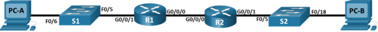

# Настройка DHCPv4 и DHCPv6 серверов

### Задание
1. [Настроить DHCPv4-серверов](README.md#настройка-dhcpv4-сервера)
2. [Настроить DHCPv6-серверов]()

### Исходные данные
#### Схема сети для настройки обоих серверов


Конфигурационные файлы маршрутизаторов [R1](../lab03/configs/R1), [R2](../lab03/configs/R2) и коммутаторов [S1](../lab03/configs/S1), [S2](../lab03/configs/S2), используемых в лабораторной работе.

### Настройка DHCPv4-сервера
#### Исходные данные
##### Таблица IP адресации
Устройство | Интерфейс  | IP Адрес  | Маска подсети | Шлюз по умолчанию 
---------- | ---------- | --------- | ------------- | -----------------
R1   | G0/0/0      | 10.0.0.1      | 255.255.255.252 | N/A
R1   | G0/0/1      | N/A           | N/A             | N/A
R1   | G0/0/1.100  | 192.168.1.1   | 255.255.255.192 | N/A
R1   | G0/0/1.200  | 192.168.1.161 | 255.255.255.224 | N/A
R1   | G0/0/1.1000 | N/A           | N/A             | N/A
R2   | G0/0/0      | 10.0.0.2      | 255.255.255.252 | N/A
R2   | G0/0/1      | 192.168.1.241 | 255.255.255.240 | N/A
S1   | VLAN 200    | 192.168.1.162 | 255.255.255.224 | 192.168.1.161
S2   | VLAN 1      | 192.168.1.242 | 255.255.255.240 | 192.168.1.241
PC-A | NIC         | DHCP          | DHCP            | DHCP 
PC-B | NIC         | DHCP          | DHCP            | DHCP
##### Таблица VLAN
VLAN | Имя | Интерфейсы
---- | --- | ----------
1	| N/A | S2: F0/18
100 | Clients | S1: F0/6
200	| Management |	S1: VLAN 200
999 | Parking_Lot |	S1: F0/1-4, F0/7-24, G0/1-2 
1000 |	Native |	N/A

#### Настройка статической маршрутизации
Настройка статической маршрутизации
```
(config)# ip route 192.168.1.0 255.255.255.192 10.0.0.1
```
Просмотр таблицы маршрутизации
```
#show ip route
```
Проверка статистической маршрутизации, с помощью пинга интерфейса G0/0/1 на маршрутизаторе R2 с маршрутизатора R1
```
R1>ping 192.168.1.241

Type escape sequence to abort.
Sending 5, 100-byte ICMP Echos to 192.168.1.241, timeout is 2 seconds:
!!!!!
Success rate is 100 percent (5/5), round-trip min/avg/max = 0/0/0 ms
```
#### Включение DHCP-сервера и создание пула IP адресов
Включить DHCP-сервер
```
(config)# service dhcp
```
Создание пула IP адресов для DHCP-сервера с задаными характеристиками:
- наименование пула clients
- диапазон адресов 192.168.1.1 – 192.168.1.63
- доменное имя ccna-lab.com
- шлюз по умолчанию 192.168.1.1
- время аренды 2 дня 12 часов 30 минут
```
(config)# ip dhcp pool clients                             
(dhcp-config)# network 192.168.1.1 255.255.255.192
(dhcp-config)# domain-name ccna-lab.com
(dhcp-config)# default-router 192.168.1.1
(dhcp-config)# lease 2 12 30
```
Исключение из пула IP адресa DHCP-сервера
```
(config)#ip dhcp excluded-address 192.168.1.1
```
#### Проверка работоспособности DHCP-сервера
Сведения о DHCP пулах (команда: show ip dhcp pool)
```
R1#show ip dhcp pool 

Pool clients :
 Utilization mark (high/low)    : 100 / 0
 Subnet size (first/next)       : 0 / 0 
 Total addresses                : 62
 Leased addresses               : 1
 Excluded addresses             : 10
 Pending event                  : none

 1 subnet is currently in the pool
 Current index        IP address range                    Leased/Excluded/Total
 192.168.1.1          192.168.1.1      - 192.168.1.62      1    / 10    / 62

Pool r2_client_lan :
 Utilization mark (high/low)    : 100 / 0
 Subnet size (first/next)       : 0 / 0 
 Total addresses                : 14
 Leased addresses               : 1
 Excluded addresses             : 10
 Pending event                  : none

 1 subnet is currently in the pool
 Current index        IP address range                    Leased/Excluded/Total
 192.168.1.241        192.168.1.241    - 192.168.1.254     1    / 10    / 14
```
Сведения о выданных ip адресах (команда: show ip dhcp bindings)
```
R1#show ip dhcp binding 
IP address       Client-ID/              Lease expiration        Type
                 Hardware address
192.168.1.6      0050.0F8B.3711           --                     Automatic
192.168.1.246    0004.9A76.5837           --                     Automatic
```
#### Настройка ретрансляции DHCP-сервера 
Настройка пересылки широковещательных пакетов от клиентов, которые приходят на интерфейс G0/0/1 маршрутизатора R2
```
(config)# interface GigabitEthernet 0/0/1
(config-if)# ip helper-address 10.0.0.1
```
Проверка работоспособности DHCP-сервера на персональном компьютере PC-B
```
C:\>ipconfig /renew

IP Address......................: 192.168.1.246
Subnet Mask.....................: 255.255.255.240
Default Gateway.................: 192.168.1.241
DNS Server......................: 0.0.0.0

C:\>ipconfig

FastEthernet0 Connection:(default port)

Connection-specific DNS Suffix..: ccna-lab.com
Link-local IPv6 Address.........: FE80::204:9AFF:FE76:5837
IPv6 Address....................: ::
IPv4 Address....................: 192.168.1.246
Subnet Mask.....................: 255.255.255.240
Default Gateway.................: ::
                                  192.168.1.241

Bluetooth Connection:

Connection-specific DNS Suffix..: ccna-lab.com
Link-local IPv6 Address.........: ::
IPv6 Address....................: ::
IPv4 Address....................: 0.0.0.0
Subnet Mask.....................: 0.0.0.0
Default Gateway.................: ::
                                  0.0.0.0

C:\>ping 192.168.1.1

Pinging 192.168.1.1 with 32 bytes of data:

Reply from 192.168.1.1: bytes=32 time=1ms TTL=254
Reply from 192.168.1.1: bytes=32 time<1ms TTL=254
Reply from 192.168.1.1: bytes=32 time=1ms TTL=254
Reply from 192.168.1.1: bytes=32 time<1ms TTL=254

Ping statistics for 192.168.1.1:
Packets: Sent = 4, Received = 4, Lost = 0 (0% loss),
Approximate round trip times in milli-seconds:
Minimum = 0ms, Maximum = 1ms, Average = 0ms
```
### Настройка DHCPv6-сервера
#### Исходные данные
##### Таблица IP адресации
Устройство | Интерфейс | IPv6 адрес
---------- | --------- | ----------
R1 | G0/0/0 | 2001:db8:acad:2::1/64
R1 | G0/0/0 | fe80::1
R1 | G0/0/1 | 2001:db8:acad:1::1/64
R1 | G0/0/1 | fe80::1
R2 | G0/0/0 | 2001:db8:acad:2::2/64
R2 | G0/0/0 | fe80::2
R2 | G0/0/1 | 2001:db8:acad:3::1/64
R2 | G0/0/1 | fe80::1
PC-A | NIC | DHCP
PC-B | NIC | DHCP
#### Настройка статической маршрутизации
Включение IPv6 маршрутизации
```
(config)# ipv6 unicast-routing
```
Статическая настройка IPv6-адреса на интерфейсе
```
(config)# interface GigabitEthernet 0/0/0
(config-if)# ipv6 address 2001:db8:acad:2::1/64
```
Настройка статического маршрута IPv6
```
(config)# ipv6 route 2001:db8:acad:3::/64 2001:db8:acad:2::2
```
Проверка работы маршрутизации
```
R1#ping 2001:db8:acad:3::1

Type escape sequence to abort.
Sending 5, 100-byte ICMP Echos to 2001:db8:acad:3::1, timeout is 2 seconds:
!!!!!
Success rate is 100 percent (5/5), round-trip min/avg/max = 0/0/0 ms
```
#### Автоматическое получение IPv6 адреса
Пример автоматического получения IPv6 персональным компьютером PC-B. Адрес интерфейса сгенерирован с помощью MAC-адреса (выделен жирно) 2001:DB8:ACAD:3:**204:9AFF:FE76:5837**
```
C:\>ipconfig

FastEthernet0 Connection:(default port)

Connection-specific DNS Suffix..: ccna-lab.com
Link-local IPv6 Address.........: FE80::204:9AFF:FE76:5837
IPv6 Address....................: 2001:DB8:ACAD:3:204:9AFF:FE76:5837
IPv4 Address....................: 192.168.1.246
Subnet Mask.....................: 255.255.255.240
Default Gateway.................: FE80::2E0:F7FF:FEAC:D202
                                  192.168.1.241

Bluetooth Connection:

Connection-specific DNS Suffix..: ccna-lab.com
Link-local IPv6 Address.........: ::
IPv6 Address....................: ::
IPv4 Address....................: 0.0.0.0
Subnet Mask.....................: 0.0.0.0
Default Gateway.................: ::
                                  0.0.0.0
```
#### DHCP-сервера без сохранения состояния
Создание пула IPv6 адресов для DHCP-сервера без сохранения состояния с задаными характеристиками:
- наименование пула R1-STATELESS 
- DNS-сервер 2001:db8:acad::254
- доменное имя STATELESS.com
```
(config)# ipv6 dhcp pool R1-STATELESS                             
(config-dhcpv6)# dns-server 2001:db8:acad::254
(config-dhcpv6)# domain-name STATELESS.com
```
Настройка интерфейса для передачи флага предоставления IPv6-префикса по протоколу SLAAC и предоставление информации о пуле DHCPv6
```
(config-if)# ipv6 nd other-config-flag
(config-if)# ipv6 dhcp server R1-STATELESS
```
Проверка работы DHCP-сервера на персональном компьютере PC-A
```
C:\>ipconfig /all

FastEthernet0 Connection:(default port)

Connection-specific DNS Suffix..: ccna-lab.com
: STATELESS.com 
Physical Address................: 0050.0F8B.3711
Link-local IPv6 Address.........: FE80::250:FFF:FE8B:3711
IPv6 Address....................: 2001:DB8:ACAD:1:250:FFF:FE8B:3711
IPv4 Address....................: 192.168.1.6
Subnet Mask.....................: 255.255.255.192
Default Gateway.................: FE80::260:3EFF:FE0D:5D02
                                  192.168.1.1
DHCP Servers....................: 192.168.1.1
DHCPv6 IAID.....................: 1266755608
DHCPv6 Client DUID..............: 00-01-00-01-47-0A-C0-3E-00-50-0F-8B-37-11
DNS Servers.....................: 2001:DB8:ACAD::254
                                  0.0.0.0

Bluetooth Connection:

Connection-specific DNS Suffix..: ccna-lab.com
                                : STATELESS.com 
Physical Address................: 0060.5C18.8956
Link-local IPv6 Address.........: ::
IPv6 Address....................: ::
IPv4 Address....................: 0.0.0.0
Subnet Mask.....................: 0.0.0.0
Default Gateway.................: ::
                                  0.0.0.0
DHCP Servers....................: 0.0.0.0
DHCPv6 IAID.....................: 1266755608
DHCPv6 Client DUID..............: 00-01-00-01-47-0A-C0-3E-00-50-0F-8B-37-11
DNS Servers.....................: ::
                                  0.0.0.0
```
#### DHCP-сервера c отслеживанием состояния
Создание пула IPv6 адресов для DHCP-сервера без сохранения состояния с задаными характеристиками:
- наименование пула R2-STATEFUL
- префикс 2001:db8:acad:3:aaaa::/80
- DNS-сервер 2001:db8:acad::254
- доменное имя STATEFUL.com
```
(config)# ipv6 dhcp pool R2-STATEFUL
(config-dhcpv6)# address prefix 2001:db8:acad:3:aaaa::/80
(config-dhcpv6)# dns-server 2001:db8:acad::254
(config-dhcpv6)# domain-name STATEFUL.com
```
Настройка интерфейса для получения всей информации от DHCPv6-сервера и ретрансляцию DHCP запросов на DHCP-сервер
```
(config-if)# ipv6 nd managed-config-flag
(config-if)# ipv6 dhcp relay destination 2001:db8:acad:2::1
```
